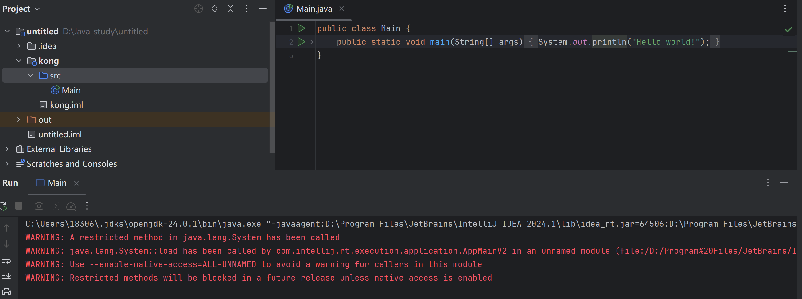
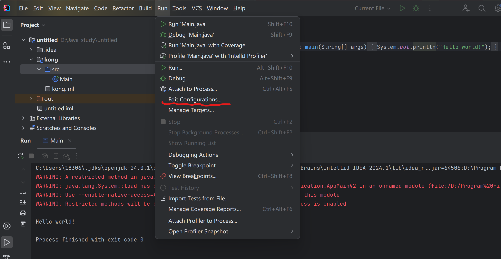
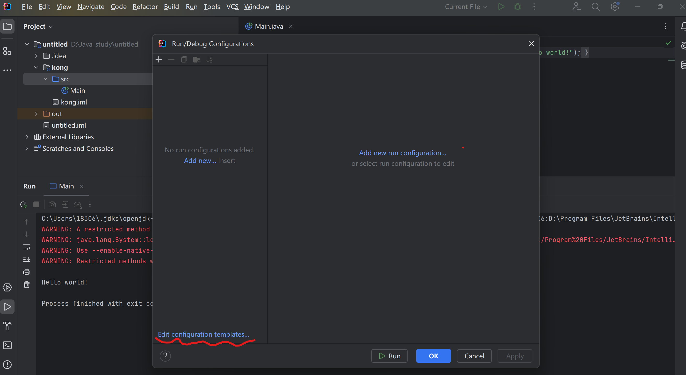
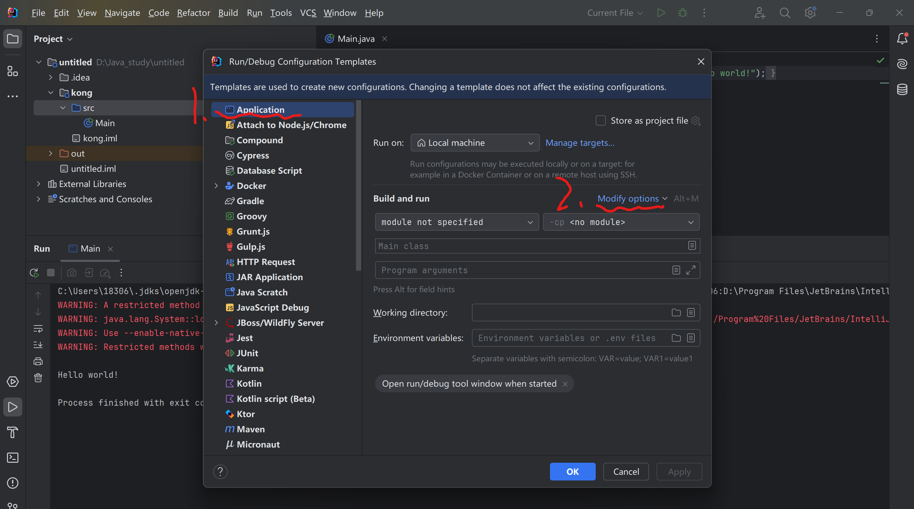
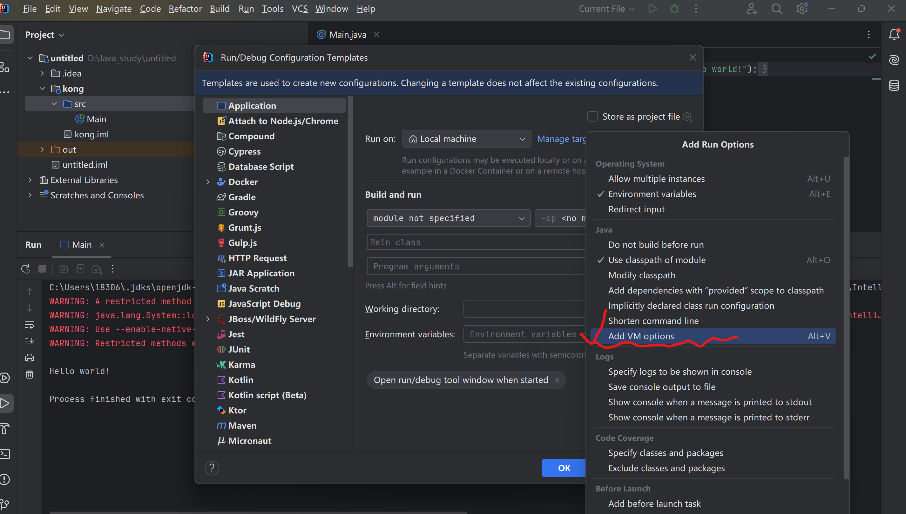
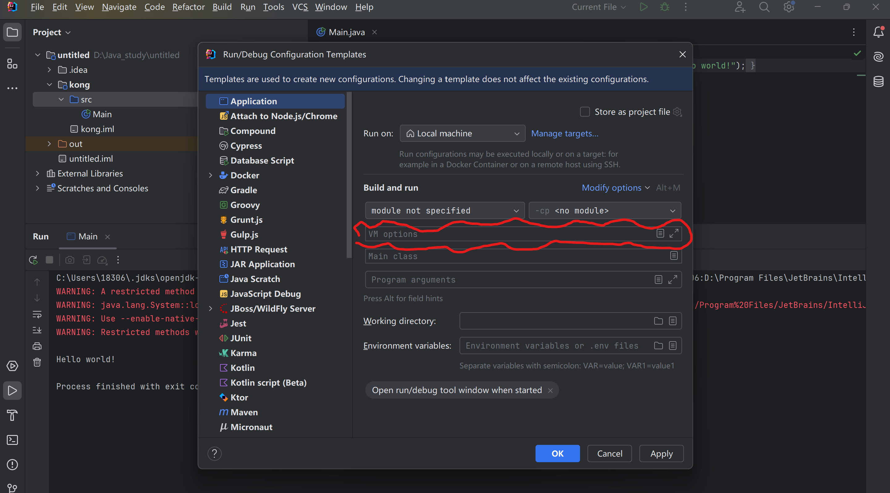
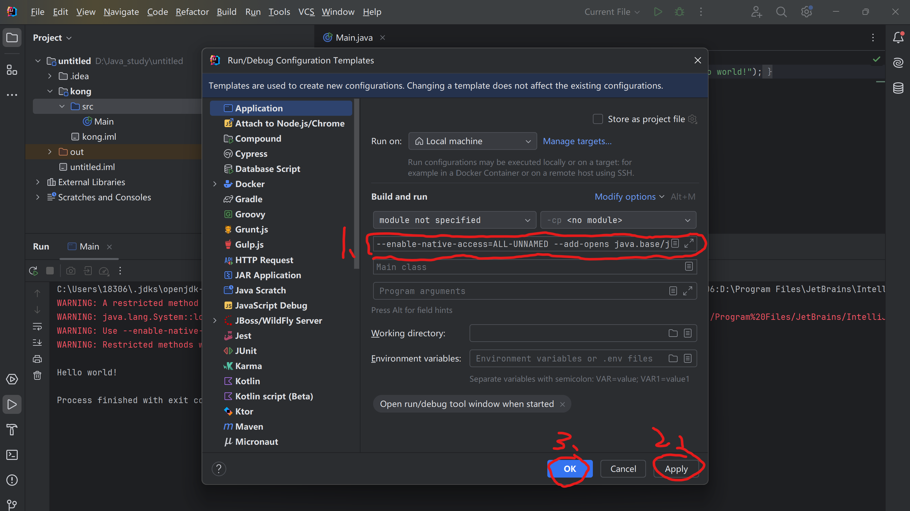
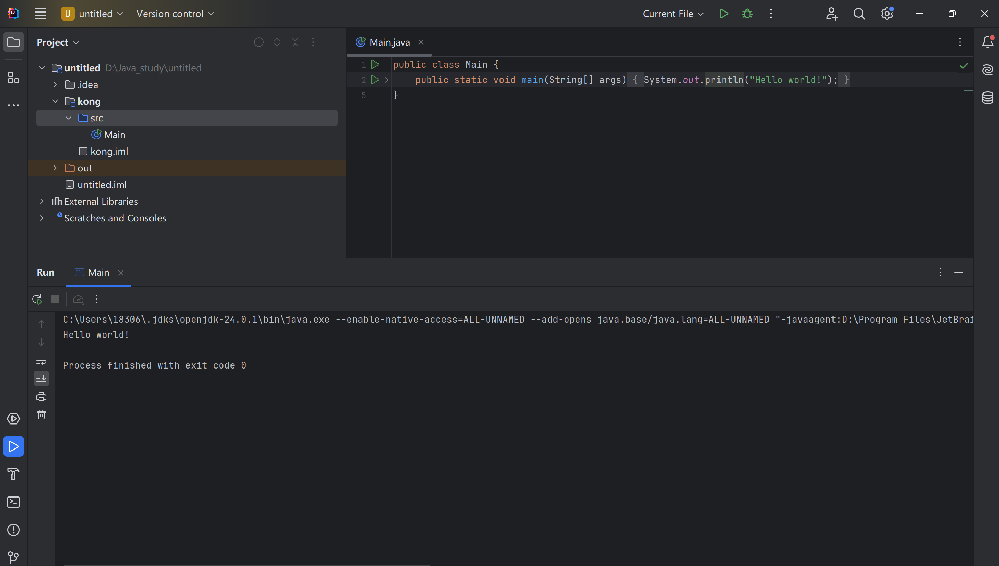

# IntelliJ IDEA 解决WARNING: A restricted method in java.lang.System has been called等警告问题

## **WARNING: A restricted method in java.lang.System has been called**

## **WARNING: Use --enable-native-access=ALL-UNNAMED to avoid a warning for callers in this module**

## **WARNING: Restricted methods will be blocked in a future release unless native access is enabled**

## **介绍：运行程序会出现警告！**

## **解决方式**

**1.找到run →** **edit configuration（**运行 → 编辑配置**），并点击**

**2.点击edit configuration（划红线），**

**3.依次点击 1.application 2.Modify options**

**4.勾选 Add VM options**

**5.勾选完成后会出现 VM options 这一栏**

**6.在 VM options 上输入，之后点击 Apply ，点击 OK**

> --enable-native-access=ALL-UNNAMED
>
> --add-opens java.base/java.lang=ALL-UNNAMED

**7.重新运行，警告消失**

